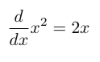
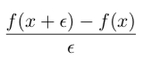

## Direction

You have 24 hours to complete this exam. However, it is designed to require two
hours. You must not discuss this exam with anyone. If the directions are
unclear, you may post questions on Piazza *privately to Instructors*. If
relevant, we'll send answers to the whole class.

**This exam has five parts. Complete any four of the five parts.** There is
no extra-credit for completing all five parts.

## Preliminaries

Create a series of directories that look like this:

<pre>
 ./exam
 |-- build.sbt
 `-- project
     `-- plugins.sbt
 `-- src
     |-- main
     |   `-- scala
     |       |-- Solution.scala
     |       `-- Types.scala
     `-- test
         `-- scala
             `-- <i>your tests goes here</i>
</pre>

Use this for `build.sbt`:


scalaVersion := "2.11.2"

libraryDependencies += "org.scalatest" %% "scalatest" % "2.2.1" % "test"


Use this for `plugins.sbt`:


addSbtPlugin("edu.umass.cs" % "cmpsci220" % "2.2")


Use this for `Types.scala`:


sealed trait BinTree[+A]
case class Node[A](lhs: BinTree[A], rhs: BinTree[A]) extends BinTree[A]
case class Leaf[A](value: A) extends BinTree[A]

trait SolutionLike {
  def ddx(f: Double => Double): Double => Double
  def isMirrored[A](tree: BinTree[A]): Boolean
  def fringe[A](tree: BinTree[A]): Stream[A]
  def sameFringe[A](fringe1: Stream[A], fringe2: Stream[A]): Boolean
  def filterIndex[A](pred: Int => Boolean, lst: List[A]): List[A]
  val notAbb: util.matching.Regex
}


Use this template for `Solution.scala`:


object Solution extends SolutionLike {

  def ddx(f: Double => Double): Double => Double = {
    throw new UnsupportedOperationException("not implemented")
  }

  def isMirrored[A](tree: BinTree[A]): Boolean = {
    throw new UnsupportedOperationException("not implemented")
  }

  def fringe[A](tree: BinTree[A]): Stream[A] = {
    throw new UnsupportedOperationException("not implemented")
  }

  def sameFringe[A](fringe1: Stream[A], fringe2: Stream[A]): Boolean = {
    throw new UnsupportedOperationException("not implemented")
  }

  def filterIndex[A](pred: Int => Boolean, lst: List[A]): List[A] = {
    throw new UnsupportedOperationException("not implemented")
  }

  val notAbb: util.matching.Regex = "".r

}


### 1. Differential Calculus

In differential calculus, you've seen notation that looks like this:

Let's unpack what all this notation means. It is obvious
that <i>x2</i> is a function that squares numbers and
<i>2x</i> is a function that doubles numbers. We know how to write these
in Scala:


def square(x: Double): Double = x * x
def double(x: Double): Double = 2 * x


What does <i>d/dx</i> mean? <i>d/dx</i> is a function, which when applied to
`square` produces `double`. Therefore, <i>d/dx</i> is a function that consumes a
function, *f* over numbers and produces a new function that is the derivative of
*f*. We can write its type in Scala as follows:


def ddx(f: Double => Double): Double => Double


Your task is to implement `ddx` using *numerical differentiation*. The value
of the derivative of *f* at a point *x* is defined by this formula--

--as 𝜖 approaches zero. If you pick a small value of 𝜖, this formula
calculates a reasonable approximation of the true value of the derivatie.
Use *0.001* as the value of 𝜖 in your implementation of `ddx`.

### 2. Mirrored Trees

`Types.scala` defines a type `BinTree`, which represents trees with values
stored at the leaves. You will use this datatype in this part.

We say a binary tree is *mirrored* if its left and right sides are miror images
of each other. For example, these trees are mirrored:

<pre>
         .                 .
        / \               / \
       /   \             /   \
      .     .           .     .
     / \   / \         / \   / \
    1   2 2   1       .   3 3   .
                     / \       / \
                    1   2     2   1
</pre>

But, these trees are **not** mirrored:

<pre>
         .                 .
        / \               / \
       /   \             /   \
      .     .           .     .
     / \   / \         / \   / \
    1   2 1   2       .   3 .   1
                     / \   / \
                    1   2 3   2
</pre>

Write a predicate called `isMirrored` that returns `true` when applied to
mirrored trees and `false` on all other trees. **Assume that
binary trees that only contain a single leaf are mirrored.**

## Part 3. Filtering Lists

Write a function called `filterIndex(pred, lst)`, where `pred` is applied to the
indices of the elements in `lst`. The function should produce a list that only
contains the elements of `lst`  that satisfy the given predicate. The elements
should be returned in order.

For example,

1. `filterIndex(n => n < 2, List("a", "b", "c", "d")` produces `List("a", "b")`
2. `filterIndex(n => n % 2 == 0, List("a", "b", "c", "d")` produces `List("a", "c")`
3. `filterIndex(n => false, lst)` produces `List()`
4. `filterIndex(n => true, lst)` produces `lst`

## Part 4. Same Fringe

`Types.scala` defines a type `BinTree`, which represents trees with values
stored at the leaves. You will use this datatype in this part.

Here are some examples of binary trees:


val example1 = Node(Node(Leaf(10), Leaf(20)), Node(Leaf(30), Leaf(40)))
val example2 = Node(Leaf(10), Node(Leaf(20), Node(Leaf(30), Leaf(40))))
val example3 = Node(Leaf(1), Node(Leaf(4), Leaf(6)))
val example4 = Node(Leaf(7), Node(Leaf(7), Leaf(6)))


The *fringe* of a tree is the list of leaf-values in left-to-right order. For
example:

1. The fringe of `example1` is `List(10, 20, 30, 40)`
2. The fringe of `example2` is `List(10, 20, 30, 40)`
3. The fringe of `example3` is `List(1, 4, 6)`
4. The fringe of `example4` is `List(7, 7, 6)`

Notice that `example1` and `example2` have the same fringe, even though the
trees are structurally distinct. It is easy to check if two trees have the same
fringe: we simply generate the fringe and check if the two lists are equal.

However, this naive approach does a lot of unnecessary work if the two trees do
not have the same fringe. For example, consider `example3` and `example4`. By
simply examining the first elements of their fringe, it is obvious that they do
not have the same fringe. But, a naive appoach would generate the entire fringe
needlessly. To address this problem, we'll use streams to generate the fringe
lazily.

Write a function called `fringe` that produces the fringe as a `Stream[A]`.
Ensure that the elements of the stream are only generated on demand. For
example, this interaction shows that elements are only generated when queried:

    scala> val r = Solution.fringe(Node(Leaf(1), Node(Leaf(4), Leaf(6))))
    r: Stream[Int] = Stream(1, ?)
    scala> r(1); r
    res0: Stream[Int] = Stream(1, 4, ?)
    scala> r(2); r
    res1: Stream[Int] = Stream(1, 4, 6, ?)

**Hint:** Use the `#:::` operator to lazily append two streams:

    > Stream(1,2,3) #::: Stream(4,5,6)
    res2: Stream[Int] = Stream(1, ?)

Using the `fringe` function you wrote above, write a function called
`sameFringe` to determine if two streams are identical. The `sameFringe`
function should short-circuit and produce `false` as soon as it finds two elements
that are not identical.

### Part 5. Regular Expressions

Write a regular expression, `notAbb` that matches all strings of `a`s and `b`s
that do not include `abb` as a substring.

These examples should match:

- `"abaab"`
- `"bbabab"`
- `"bbb"`

These examples should not match:

- `"abb"`
- `"cab"`
- `"aababba"`

## Submit Your Work

Use the `submit` command within `sbt` to create `submission.tar.gz`. Upload
this file to Moodle.

