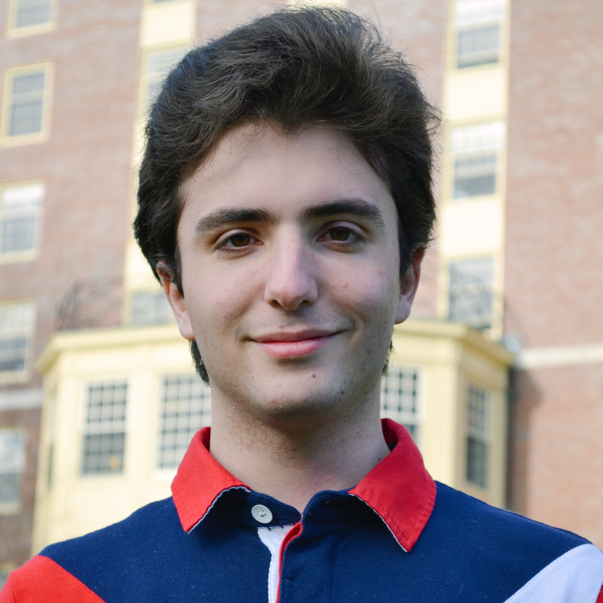
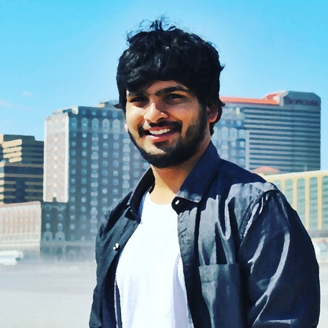

Welcome to the Fall 2016 offering of COMPSCI220 Programming Methodology!

You must read the entire [Course Policy] document.

# Course Locations

<table class="table table-striped">
<thead>
  <tr><th>What</th><th>When</th><th>Where</th></tr>
</thead>
<tbody>
<tr><td>Lecture</td><td>Tuesday, 2:30PM--3:45PM</td><td>Engineering Lab II, Room 119</td></tr>
<tr><td>Discussion AA</td><td>Wednesday, 9:05AM--9:55AM</td><td>Ag. Engineering Building, Room 119</td></tr>
<tr><td>Discussion AB</td><td>Wednesday, 10:10AM--11:00AM</td><td>Ag. Engineering Building, Room 119</td></tr>
<tr><td>Lecture</td><td>Thursday, 2:30PM--3:45PM</td><td>Engineering Lab II, Room 119</td></tr>
</tbody>
</table>

# Office Hours

| When                       | Where                                | Who                                        |
|:---------------------------|--------------------------------------|--------------------------------------------|
| Sunday, 11AM--noon         | USpace (CS Building, Room 144)       | Jane Tangen and Aaron Weiss                |
| Monday, 11AM--12:15PM      | USpace (CS Building, Room 144)       | Jesse Bartola, John Geenty and Harsh Poddar|
| Wednesday, 11AM--noon      | LGRT, Room 225                       | Kyle Vedder and Itamar Levy-Or             |
| Friday, 3PM--4PM           | CS Building, Room 230                | Arjun Guha                                 |
{: .table .table-striped :}

# Meet the Staff

  

  	

      
  	   
  	

    

      
       
    

    

      
       
    

    

      
       
    

  

  

  	

      
       
  	

  	

      
       
  	

    

      
       
    

    

      
       
    

  

# Textbook

There is no required textbook. Instead, you must read the lecture notes posted on the
schedule, which includes references to other online resources when appropriate.

If you want to read a book on Scala programming, we recommend the following book:

[Programming in Scala: A Comprehensive Step-by-Step Guide (2nd Edition), Odersky, Spoon, Venners][textbook]

[Course Policy]: ../policies
[textbook]: http://www.amazon.com/Programming-Scala-Comprehensive-Step-Step/dp/0981531644
