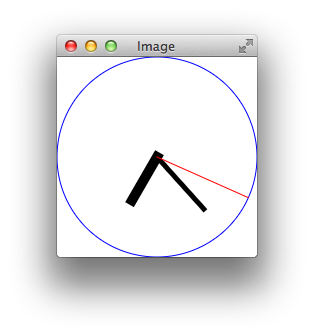

Introduction
------------

For this assignment, you will develop types and functions to represent an alarm
clock. You will first write functions over a `Time` type that we have defined
for you. You will then use this type to define the `AlarmClock` type yourself
and several functions over `AlarmClock`. Finally, you will develop functions to
draw `AlarmClock`s using a simple [graphics] graphics library.

Setup
-----

Before you start programming, you need to complete a few preliminary steps.

- Download and start the course virtual machine (click the Software link at the
  top of this page). You will need it for all the assignments in this class.

- Create a directory that will store your solution to this assignment
  (e.g., call it the `hw1` directory).

- Using a text editor, create a file called `clocks.scala` in the assignment
  directory. *(Note: all lowercase letters.)*

At the top of `clocks.scala`, add these two lines of code:


import cmpsci220._
import cmpsci220.graphics._


Time
----

To build the alarm clock, we first need a type to represent the current time.
Your program should use the following case class to do so:


case class Time(hours : Int, minutes : Int, seconds : Int)


The `Time` type has three members that represent time in hour, minutes, and
seconds, using integers. However, not all `Time` values are meaningful
representations of time. Here are some examples of valid times:


val ex1 = Time(0, 1, 0)
val ex2 = Time(7, 23, 19)
val ex3 = Time(23, 50, 0) // We are using military time


But, the following values are invalid:


val ex5 = Time(0, -1, 0)
val ex6 = Time(7, 0, 200)


Write a function called <code>isValidTime</code> that returns <code>true</code>
if the time is valid and <code>false</code> otherwise. The
<code>isValidTime</code> function must have the following type:


def isValidTime(time : Time) : Boolean
</li>

Write a function called <code>tick</code> that takes a time-value as an argument
and evaluates to a new time that is one second in the future. The
<code>tick</code> function must have the following type:


def tick(time : Time) : Time


Here are two test cases that the function should pass. You <i>must</i> write
more tests yourself:


test("8:30:01 is after 8:30:00") {
  assert(tick(Time(8, 30, 0)) == Time(8, 30, 1))
}

test("8:30:00 is after 8:29:59") {
  assert(tick(Time(8, 29, 59)) == Time(8, 30, 0))
}


You should assume that the argument to <code>tick</code> is a valid time and
ensure that the result of <code>tick</code> is also a valid time.

Alarms
------

An alarm clock must keep track of (1) the current time, (2) the alarm time, and
(3) if the alarm is on. Design a case class called <code>AlarmClock</code> to do
so:


case class AlarmClock(/*... add members here ... */)


Write and test the following functions that manipuate <code>AlarmClock</code> values.


// Maps a time to an AlarmClock with the alarm turned off
def toAlarmClock(time : Time) : AlarmClock

// Produces the time stored in the alarm clock
def getTime(clock : AlarmClock) : Time

// Produces true if the alarm is on
def isAlarmOn(clock : AlarmClock) : Boolean

// Produces a new AlarmClock with the alarm set to the specified time
def setAlarm(clock : AlarmClock, alarmTime : Time) : AlarmClock

// Produces a new AlarmClock that (1) has advanced the current time by one
// second and (2) has the alarm turned on
def tickAlarmClock(clock : AlarmClock) : AlarmClock


**Check Your Work**: From the command-line, run the command:

    check220 check clocks step1

Drawing Clock Hands
-------------------

Write a function called `drawHands` that takes a `Time` and evaluates to an
`Image` of clock hands. (Ignore the clock face for the moment). The `drawHands`
function must have the following type:


def drawHands(time : Time) : Image


You will need to use the following functions from the [graphics] library:

<ul>

<li>The <code>angle</code> function draws a line at an angle, measured in
  degrees from the horizontal axis. It has parameters that determine the length,
  width, and color of the line. You should use it to draw the hands of the
  clock.</li>

<li>The <code>overlay</code> function places one image on top of another. You
  should use it to combine the images of each hand into a composite image of the
  clock. Clocks typically have the second hand on top of the minute hand and the
  minute hand on top of the hour hand.</li>

<li>The <code>move</code> function moves an image. The lengths of clocks hands
  are different: the second hand is longer than the minute hand, which is longer
  than the hour hand. If you only use <code>angle</code> and
  <code>overlay</code>, the hands will not be centered. You will need to use
  <code>move</code> to move the hour and minute hands onto the second hand.</li>

<li>The <code>show</code> function displays an image. For example, the following
expression


show(drawHands(Time(7, 23, 19)))


  may draw a clock that looks like this: 

   

  You don't have to exactly reproduce this image, but your clock must look
  "reasonable": each hand should have a different length and all arms should
  be centered.</li>

</ul>

Animate the Clock
-----------------

Now that you have a function to draw a clock, you can write a function to tick
the clock every second. You can use the `animate` function in the graphics
library to do so. Write a function with the following type.


def animateAlarmClock(start: AlarmClock): AlarmClock


The body should call the `animate` function from the graphics library. Call
`tick` to update the clock every second and use the `drawHands` function display
the clock.

**Check Your Work**: From the command-line, run the command:

    check220 check clocks step2

Hand In
-------

From the command-line, run the command:

    check220 tar clocks final

This command will create the file `submission-clocks-final.tgz`. Submit this
file using Moodle.

[graphics]: ../../lib/api/#cmpsci220.graphics.package

