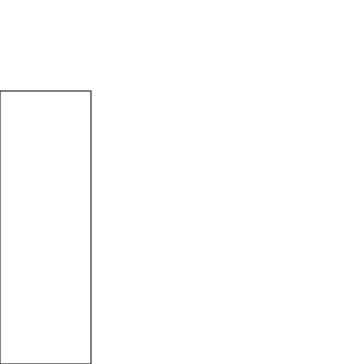
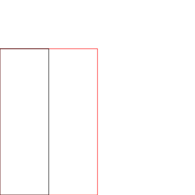
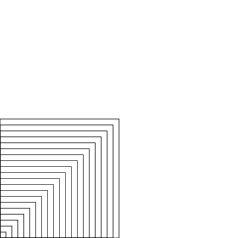
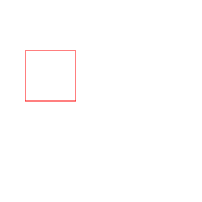
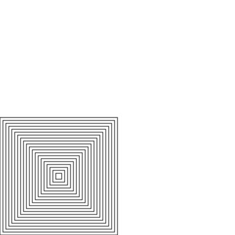

For the first few assignments, you will use a simply library that we've
developed for this course. The library has some basic data structures, some
testing code, and functions to draw and animate images. In a few weeks, we'll
start using professional libraries.

Import these libraries by adding import statements at the top
of your file or typing them into the REPL:

~~~ scala
import cmpsci220._
import cmpsci220.graphics._
~~~

These import statements give you access to several functions and types.

The graphics library has several functions that construct simple images.
For example:

~~~ scala
scala> val rect1 = rect(100, 300)
rect1: cmpsci220.graphics.Image = rect(100.0, 300.0, black)

scala> val rect2 = rect(200, 300, red)
rect2: cmpsci220.graphics.Image = rect(200.0, 300.0, red)

scala> val oval1 = oval(300, 100, blue)
oval1: cmpsci220.graphics.Image = oval(300.0, 100.0, blue)
~~~

However, these functions do not display images themselves. To actually look
at an image, you need to use the *show* function:

~~~ scala
scala> show(rect1)
~~~

The *show* function only displays one image at a time. To show more complex
images, you have build a composite image. The simplest image composition
operator is *overlay*, which draws images on top of each other:

~~~ scala
scala> val twoRects = overlay(rect1, rect2)
twoRects: cmpsci220.graphics.Image = overlay(rect(100.0, 300.0, black), rect(200.0, 300.0, red))
show(twoRects)
~~~

Here is a simple function that draws several nested rectangles:

~~~ scala
def manyRectangles(length: Int): Image = {
  if (length <= 0) {
    blank
  }
  else {
    overlay(rect(length, length), manyRectangles(length - 10))
  }
}

val many1 = manyRectangles(200)

show(manyRectangles(200))
~~~

If you run this code, you'll find that all rectangles are drawn at the bottom-
left corner, which has coordinate the (0,0):

Suppose we wanted the rectangles to be centered in the middle of the image.
Do so we, we need to use *move* function:

~~~ scala
show(move(rect(100, 100, red), 50, 200))
~~~

We can correct `manyRectangles` by moving the inner image:

~~~ scala
def manyCenteredRects(length: Int): Image = {
  if (length <= 0) {
    blank
  }
  else {
    overlay(rect(length, length), move(manyCenteredRects(length - 10), 5, 5))
  }
}

show(manyCenteredRects(200))
~~~

All these functions are are documented in the [Library Documentation].
You should read the documentation and experiment with the functions.
