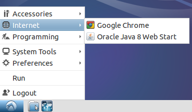

To do the homework and projects for this class, you'll need Scala and some
course-specific software. There are few options for setting this up.

## Virtual Machine

If your computer runs Windows, you need to use a [virtual machine] that we've
built for the course.

1. Download and install [VirtualBox]

2. Download [cmpsci220.ova] (1.51 GB)

3. Double-click on the `cmpsci220.ova` file you downloaded above (or, select
   *Import Appliance* from the File menu and select the file). When you do,
   VirtualBox will start and display a prompt called *Appliance Settings*.
   Do not change any settings. Just click the *Import* button. When importing
   completes, the virtual machine will appear in VirtualBox, as shown below:

   

4. Select the CS220 virtual machine and click the *Start* button. If the
   machine starts successfully, you will see the desktop shown below:

   

5. To test that everything is working correctly, start Google Chrome within
   the virtual machine and ensure you can browse the Web. You'll find a link
   to Chrome within the start menu in the bottom-left corner:

   

### More Information

For the curious, this virtual machine is running [Lubuntu] Linux 14.04 (32-bit).

## Windows (Alternative)

We recommend using the virtual machine above. But, if you have trouble running
a virtual machine, you can run Scala without a VM by following these directions:

1. [Install Java]((http://www.oracle.com/technetwork/java/javase/downloads/jdk8-downloads-2133151.html).)

   If you already have Java installed, you need to ensure that it is Java 8
   or higher.

2. Install [SBT](http://www.scala-sbt.org)

3. Install [Cygwin](http://www.cygwin.com).

4. Start the Cygwin command-line (By default, the installer will create a shortcut on your
   Desktop) and enter the following commands:

       mkdir "/cygdrive/c/Users/$USERNAME/.sbt"
       mkdir "/cygdrive/c/Users/$USERNAME/.sbt/0.13"
       mkdir "/cygdrive/c/Users/$USERNAME/.sbt/0.13/plugins"
       echo 'addSbtPlugin("edu.umass.cs" % "cmpsci220" % "3.0.0")' > "/cygdrive/c/Users/$USERNAME/.sbt/0.13/plugins/plugins.sbt"

5. To verify that everything installed, type `sbt` to start SBT. You should see
   output that looks like this:

       [info] Loading global plugins from /Users/arjun/.sbt/0.13/plugins
       [info] Updating {file:/Users/arjun/.sbt/0.13/plugins/}global-plugins...
       [info] Resolving org.fusesource.jansi#jansi;1.4 ...
       [info] downloading https://repo.scala-sbt.org/scalasbt/sbt-plugin-releases/edu.umass.cs/cmpsci220/scala_2.10/sbt_0.13/3.0.0/jars/cmpsci220.jar ...
       [info]   [SUCCESSFUL ] edu.umass.cs#cmpsci220;3.0.0!cmpsci220.jar (1261ms)

## Mac OS X

1. Install [Homebrew](http://brew.sh) (follow the directions on the website).

2. Install Java:

       brew cask install java

3. Install SBT:

       brew install sbt

4. Install the SBT plugin:

       mkdir ~/.sbt
       mkdir ~/.sbt/0.13
       mkdir ~/.sbt/0.13/plugins
       echo 'addSbtPlugin("edu.umass.cs" % "cmpsci220" % "3.0.0")' > ~/.sbt/0.13/plugins/plugins.sbt

5. To verify that everything installed, type `sbt` to start SBT. You should see
   output that looks like this:

       [info] Loading global plugins from /Users/arjun/.sbt/0.13/plugins
       [info] Updating {file:/Users/arjun/.sbt/0.13/plugins/}global-plugins...
       [info] Resolving org.fusesource.jansi#jansi;1.4 ...
       [info] downloading https://repo.scala-sbt.org/scalasbt/sbt-plugin-releases/edu.umass.cs/cmpsci220/scala_2.10/sbt_0.13/3.0.0/jars/cmpsci220.jar ...
       [info]   [SUCCESSFUL ] edu.umass.cs#cmpsci220;3.0.0!cmpsci220.jar (1261ms)

## Linux (Ubuntu)

1. Install Java 8:

       add-apt-repository -y ppa:webupd8team/java
       apt-get update
       apt-get install -y oracle-java8-installer

2. Install SBT:

       wget http://dl.bintray.com/sbt/debian/sbt-0.13.9.deb
       dpkg -i sbt-0.13.9.deb
       rm sbt-0.13.9.deb
       apt-get -f -y install

3. Install the SBT plugin:

       mkdir ~/.sbt
       mkdir ~/.sbt/0.13
       mkdir ~/.sbt/0.13/plugins
       echo 'addSbtPlugin("edu.umass.cs" % "cmpsci220" % "3.0.0")' > ~/.sbt/0.13/plugins/plugins.sbt

4. To verify that everything installed, type `sbt` to start SBT. You should see
   output that looks like this:

       [info] Loading global plugins from /Users/arjun/.sbt/0.13/plugins
       [info] Updating {file:/Users/arjun/.sbt/0.13/plugins/}global-plugins...
       [info] Resolving org.fusesource.jansi#jansi;1.4 ...
       [info] downloading https://repo.scala-sbt.org/scalasbt/sbt-plugin-releases/edu.umass.cs/cmpsci220/scala_2.10/sbt_0.13/3.0.0/jars/cmpsci220.jar ...
       [info]   [SUCCESSFUL ] edu.umass.cs#cmpsci220;3.0.0!cmpsci220.jar (1261ms)

[virtual machine]: http://en.wikipedia.org/wiki/Virtual_machine
[VirtualBox]: https://www.virtualbox.org/wiki/Downloads
[cmpsci220.ova]: https://storage.googleapis.com/umass-cmpsci220-artifacts/cmpsci220.ova
[Lubuntu]: http://lubuntu.net
