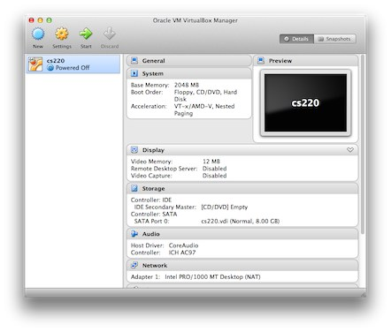

We have created a [virtual machine] with Scala and several other course-specific
software tools installed. You must use this virtual machine to do the homework
and projects for the class. Follow the steps below to install the virtual
machine:

1. Download and install [VirtualBox]:

   - [VirtualBox for Mac]
   - [VirtualBox for Windows]
   - [VirtualBox for Linux]

2. Download [CS220.ova] (1.37 GB)

3. Double-click on the `cs220.ova` file you downloaded above (or, select
   *Import Appliance* from the File menu and select the file). When you do,
   VirtualBox will start and display a prompt called *Appliance Settings*.
   Do not change any settings. Just click the *Import* button. When importing
   completes, the virtual machine will appear in VirtualBox, as shown below:

   

4. Select the CS220 virtual machine and click the *Start* button. If the
   machine starts successfully, you will see the desktop shown below:

   

5. To test that everything is working correctly, start Google Chrome within
   the virtual machine and ensure you can browse the Web. You'll find a link
   to Chrome within the start menu in the bottom-left corner:

   

### More Information

For the curious, this virtual machine is running [Lubuntu] Linux 14.04 (64-bit).
More specifically, it is a [minimal] installation of Ubuntu configured
with [this script].

[virtual machine]: http://en.wikipedia.org/wiki/Virtual_machine
[VirtualBox]: https://www.virtualbox.org
[VirtualBox for Mac]: http://download.virtualbox.org/virtualbox/4.3.12/VirtualBox-4.3.12-93733-OSX.dmg
[VirtualBox for Windows]: http://download.virtualbox.org/virtualbox/4.3.12/VirtualBox-4.3.12-93733-Win.exe
[VirtualBox for Linux]: https://www.virtualbox.org/wiki/Linux_Downloads
[CS220.ova]: http://storage.googleapis.com/arjun-umass-disks/cs220.ova
[Lubuntu]: http://lubuntu.net
[minimal]: https://help.ubuntu.com/community/Installation/MinimalCD
[this script]: https://github.com/cmpsci220/support-code/blob/master/virtual-machine/setup.sh