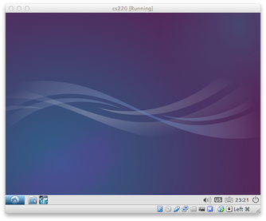

To do the homework and projects for this class, you'll need Scala and some
course-specific software. We recommend installing Scala on your
own machine. If you have a lot of trouble, you can use the *virtual machine*
discussed below.

## Windows

1. [Install Java](http://www.oracle.com/technetwork/java/javase/downloads/jdk8-downloads-2133151.html).

   If you already have Java installed, you need to ensure that it is Java 8
   or higher.

2. Install [SBT](http://www.scala-sbt.org)

3. Install [Cygwin](http://www.cygwin.com).

4. Verify that everything installed by typing `sbt` to start SBT from the
   Cygwin terminal.

## Mac OS X

1. Install [Homebrew](http://brew.sh).

      `/usr/bin/ruby -e "$(curl -fsSL https://raw.githubusercontent.com/Homebrew/install/master/install)"`

2. Install Java from the Terminal:

      `brew cask install java`

3. Install SBT from the Terminal:

      `brew install sbt`

5. To verify that everything installed, type `sbt` to start SBT.

## Linux (Ubuntu):

1. Install Java 8:

       add-apt-repository -y ppa:webupd8team/java
       apt-get update
       apt-get install -y oracle-java8-installer

2. Install SBT:

       echo "deb https://dl.bintray.com/sbt/debian /" | sudo tee -a /etc/apt/sources.list.d/sbt.list
       sudo apt-key adv --keyserver hkp://keyserver.ubuntu.com:80 --recv 2EE0EA64E40A89B84B2DF73499E82A75642AC823
       sudo apt-get update
       sudo apt-get install sbt

3. To verify that everything installed, type `sbt` to start SBT.

## Virtual Machine

To use the [virtual machine], you will need at least 4 GB of RAM and a modern
processor.

1. Download and install [VirtualBox]

2. Download [compsci220.ova] (1.1 GB)

3. Double-click on the `compsci220.ova` file you downloaded above (or, select
   *Import Appliance* from the File menu and select the file). When you do,
   VirtualBox will start and display a prompt called *Appliance Settings*.
   Do not change any settings. Just click the *Import* button. When importing
   completes, the virtual machine will appear in VirtualBox, as shown below:

   

4. Select the CS220 virtual machine and click the *Start* button. If the
   machine starts successfully, you will see the desktop shown below:

   

5. To test that everything is working correctly, start Firefox within
   the virtual machine and ensure you can browse the Web. You'll find a link
   to Firefox within the start menu in the bottom-left corner:

   

### More Information

For the curious, this virtual machine is running [Lubuntu] Linux 14.04 (32-bit).

[virtual machine]: http://en.wikipedia.org/wiki/Virtual_machine
[VirtualBox]: https://www.virtualbox.org/wiki/Downloads
[compsci220.ova]: https://storage.googleapis.com/umass-compsci220/compsci220.ova
[Lubuntu]: http://lubuntu.net
